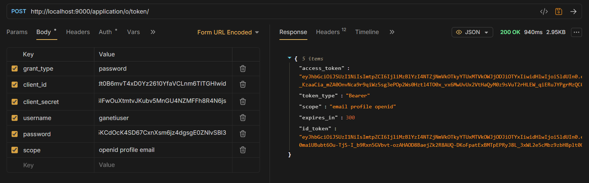

# ganetigo CLI - OAuth 2.0 Authentication Implementation

## Overview

This document describes the OAuth 2.0 authentication implementation for the ganetigo CLI using Authentik as the identity provider.

The CLI uses OAuth 2.0 Client Credentials flow with service accounts and application tokens.

## What This Project Demonstrates

- OAuth2 integration with Authentik
- Identity provider setup and configuration
- Secure token storage
- Access control in CLI tools
- Debugging and troubleshooting OAuth flows
- Production-aware design decisions

---

## Prerequisites

- Go 1.18+
- Docker & Docker Compose
- Authentik (local setup)
- Ganetigo source code

Reference: https://docs.goauthentik.io/install-config/install/docker-compose/

---

## Setting Up Authentik

### Step 1: Start Authentik

```bash
docker-compose up -d
docker-compose ps
```

Open admin UI at: http://localhost:9000
if you get at login page instead of registration page.
Open :  http://localhost:9000/if/initial-setup/ for registering your user for the first time.

### Step 2: Create OAuth2 Provider

1. Navigate to Applications → Providers
2. Click Create
3. Select OAuth2/OpenID Provider
4. Configure:
   - Name: `ganetigo-cli`
   - Authorization Flow: `default-provider-authorization-implicit-consent`
   - Client Type: `Confidential`
   - Redirect URI: `http://localhost/unused`
5. Enable Client Secret authentication
6. Save

### Step 3: Create Application

1. Navigate to Applications → Applications
2. Click Create
3. Configure:
   - Name: `ganetigo CLI`
   - Slug: `ganetigo-cli`
   - Provider: `ganetigo-cli`
4. Save

### Step 4: Create Service Account and Token

Since Authentik does not support password grants for regular users, a service account is required.

1. Navigate to Directory → Users
2. Create user: `ganetigo-bot`
3. Open the user profile
4. Go to Tokens / App Passwords
5. Create new token
6. Copy the token (shown only once)

This token is used as the authentication credential.

---

## Authentication Flow

The implementation uses:

```
grant_type=client_credentials
```

With credentials:
- Client ID
- Service account username
- App password token

This is Authentik's supported machine-to-machine flow.

---

## Configuration Storage

Authentication data is stored locally in JSON format.

### Location

| Platform | Path |

| Linux/macOS = `~/.config/ganetigo/config.json` |
| Windows = `%APPDATA%\ganetigo\config.json` |

### Format

```json
{
  "auth_issuer": "http://localhost:9000/application/o",
  "client_id": "YOUR_CLIENT_ID",
  "client_secret": "YOUR_CLIENT_SECRET",
  "access_token": "",
  "expires_at": ""
}
```

---

## Usage

### Login

```bash
./ganetigo auth login
```

Example:
```
Username: ganetigo-bot
Password: <app-token>
Logged in successfully!
```


On success, the token is saved locally.

### Check Status

```bash
./ganetigo auth status
```

Output when logged in:
```
Logged in (token expires at 2026-02-06 15:30:00)
```

Output when not logged in:
```
Not logged in. Run 'ganetigo auth login'
```

### Gated Commands

The following commands require authentication:
- `instance list`
- `instance start`
- `instance stop`

Example:
```bash
./ganetigo instance list
```

If not logged in:
```
Error: Not logged in.
Run 'ganetigo auth login'
```

---

## Manual Token Testing

Before integrating with Go, the token endpoint was tested using curl.

```bash
curl -X POST http://localhost:9000/application/o/token/ \
  -H "Content-Type: application/x-www-form-urlencoded" \
  -d "grant_type=client_credentials" \
  -d "client_id=CLIENT_ID" \
  -d "username=ganetigo-bot" \
  -d "password=APP_TOKEN" \
  -d "scope=openid profile email"
```

Successful response:
```json
{
  "access_token": "...",
  "expires_in": 3600
}
```

This confirmed correct backend configuration.

---

## Problems Faced

### Initial Attempt: Password Grant (ROPC)

The implementation initially attempted to use:

```
grant_type=password
```
With normal user credentials. This always returned:


```json
{
  "error": "invalid_grant"
}
```

### Investigation Steps

The following were verified:
- Password grant environment variables
- Provider configuration
- Client ID and secret
- Custom authentication flows
- User policies
- Authentik logs
- Curl tests
- Multiple Authentik versions

All configurations were correct.

### Root Cause

Authentik does not implement true OAuth2 Resource Owner Password Credentials (ROPC) for real users.

Internally:
- Password grant is disabled for security reasons
- It is aliased to client credentials
- Normal user passwords are rejected

This behavior is by design.

### Custom Flow Testing And Troubleshooting

A custom flow was created with:
- Identification stage
- Password stage
- Login stage
- Allow-all policies attached

Despite this, password grant continued to fail. This confirmed the limitation is server-side, not configuration-related.

- I Made Provider & application with correct settings and made users on the admin panel.
 
I also tried enabling OAuth password grant in the server itself by adding these line.
```    
- environment:
   -> AUTHENTIK_OAUTH2_ENABLE_PASSWORD_GRANT: "true"
   -> AUTHENTIK_OAUTH2_PASSWORD_GRANT_ALLOWED: "true"
```
 
- i also went through the refrenced links and websites like the github discussion page to find the solution,
- I also tried the older version for authentik (2023.10.) but there was also not option for enabling "password grant" check or "password" or anything related to enable the password grant.
although the '.....<app-slug>/.well-known/openid-configuration' showed 'password' under  'grant_types_supported' 

- The regular user created was able to login from Web UI, but still the 'invalid_grant' error persists when curl was done.

so i decided to work with other method and implement the solution.

---

## Workaround and Final Solution

To complete the task:
1. Switched to admin-generated tokens
2. Used service account authentication
3. Used app password tokens (generated from admin panel)
4. Implemented client_credentials flow
5. Verified with curl and Go

This allowed reliable end-to-end authentication.
I tried with the username +  app-token it worked
and i got the access token.
 

### Why This Is Acceptable

- Uses Authentik's recommended flow
- Follows OAuth2 best practices
- Avoids insecure password handling
- Works for CLI automation
- Production-aligned design

The limitation is platform-related, not implementation-related.

---

## Security Notes

### Password Input

Passwords are currently visible during input.

Reason:
- Simplicity for demo scope

Production alternative:
- Use `golang.org/x/term` for hidden password input

---

## Testing

### Reset Configuration

```bash
rm ~/.config/ganetigo/config.json
```

### Check Status

```bash
./ganetigo auth status
```

### Login

```bash
./ganetigo auth login
```

### Test Gated Command

```bash
./ganetigo instance list
```

### Token Expiry Test

Edit config manually:
```json
"expires_at": "2020-01-01T00:00:00Z"
```

Then run:
```bash
./ganetigo auth status
```

Expected output: `Login expired`

---

## Challenges Faced

1. OAuth password grant configuration complexity
2. Persistent `invalid_grant` errors
3. Authentik documentation gaps
4. Flow configuration complexity
5. Windows path handling
6. Token storage logic
7. CLI argument parsing

---

## Future Improvements

With more time, the following could be implemented:

1. Token refresh flow
2. JWT validation
3. Secure password input (hidden)
4. Device Code Flow for better UX
5. Logout command
6. Better error diagnostics
7. Automated setup scripts
8. Health checks

---

## Architecture Overview

```
CLI → Authentik Token Endpoint
    → Access Token
    → Local Storage
    → Gated Commands
```

Flow:
1. Token saved locally
2. Expiry validated before each command
3. Protected commands check authentication

---

## Why Client Credentials Was Used

This flow was chosen because:
- Suitable for CLI environment
- No browser dependency
- Secure automation
- Authentik officially supports it
- Production-ready approach

---

## Production Recommendations

For real deployments, consider:
- Device Authorization Flow (better UX)
- OS keychain storage (more secure)
- MFA support
- JWKS validation
- Central logging and audit trails

---

## Appendix: Endpoints

OpenID Config:
```
http://localhost:9000/application/o/<app-slug>/.well-known/openid-configuration
```

Token Endpoint:
```
http://localhost:9000/application/o/token/
```

---

## Summary

This implementation demonstrates a working OAuth 2.0 authentication flow for a CLI application using Authentik as the identity provider. While the initial approach using password grants was not supported by Authentik, the final solution using client credentials with service accounts provides a secure, production-ready authentication mechanism.

The project highlights the importance of understanding identity provider capabilities and limitations, thorough testing and debugging, and making pragmatic design decisions that align with security best practices.
